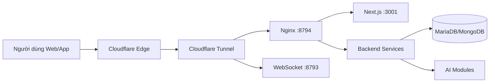

# Kiến trúc hệ thống — Hust Media

Tài liệu này tóm lược Chương 2, tập trung vào cấu hình hạ tầng, cách bảo vệ IP gốc bằng Cloudflare Tunnel và cách các cổng dịch vụ phối hợp trong hệ sinh thái Hust Media.

## Cấu hình server vật lý (128GB RAM)

Hust Media ưu tiên hạ tầng on-premise để kiểm soát chi phí và dữ liệu. Cấu hình chọn **128GB RAM** nhằm đáp ứng đồng thời ba nhóm tải chính:

- **AI module (TTS/STT, OCR, xử lý ảnh)**: các model thường chiếm nhiều RAM khi load weights và xử lý batch, đặc biệt khi chạy song song nhiều pipeline.
- **Backend Node.js/Go**: các service real-time và API gateway cần RAM để giữ cache, hàng đợi, và duy trì độ trễ thấp khi số lượng kết nối tăng.
- **Ổn định dài hạn**: RAM dư giúp tránh swap I/O, giảm nguy cơ treo tiến trình và tạo “headroom” khi hệ thống mở rộng module mới.

Tóm gọn: 128GB RAM không chỉ để chạy AI mà còn đảm bảo backend và các dịch vụ nền hoạt động ổn định, không bị nghẽn tài nguyên trong giờ cao điểm.

## Cloudflare Tunnel: “Hầm” bảo vệ IP gốc

Thay vì mở trực tiếp IP public, hệ thống dùng **Cloudflare Tunnel** để tạo một “đường hầm” từ server nội bộ ra internet. Cách này giúp:

- **Ẩn IP gốc**: người ngoài chỉ thấy edge của Cloudflare, không truy ra IP thật.
- **Giảm rủi ro DDoS/quét cổng**: lớp edge chặn request bất thường trước khi tới server.
- **Triển khai linh hoạt**: map nhiều hostname tới nhiều dịch vụ nội bộ mà không cần mở port public.

Luồng cơ bản: Server nội bộ → cloudflared tạo tunnel → Cloudflare edge → người dùng truy cập qua domain công khai.

## Bảng Port Mapping

| Cổng | Vai trò | Mô tả |
| --- | --- | --- |
| 3000 | Legacy/Default dev | Cổng mặc định của Next.js khi chạy dev (tham chiếu/compat). |
| 3001 | Next.js dev | Cổng chạy hiện tại của frontend Hust Media. |
| 8793 | WebSocket | Gateway realtime (ws) cho thông báo và đồng bộ trạng thái. |
| 8794 | Nginx | Reverse proxy, chuẩn hóa đường dẫn và route API nội bộ. |

## Sơ đồ kiến trúc (Mermaid)

