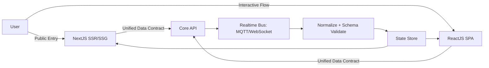

# Core Engine: Hybrid Architecture (ReactJS + NextJS)

## Design Philosophy
Core Engine triển khai **Hybrid UI Architecture** theo nguyên tắc “một logic, hai lớp trình bày”. **ReactJS** đảm nhiệm **high‑interaction workflows** và **real‑time UX**, trong khi **NextJS** xử lý **SSR/SSG entry points** để tối ưu **SEO** và **first paint**. Cả hai lớp UI dùng chung **Unified Data Contract** nên hành vi render thống nhất và không nhân đôi business rules.

Key principles:
- **Unified Data Contract** đảm bảo schema JSON ổn định giữa SPA và SSR.
- **Dual Routing Mechanism** phân luồng public entry vs. micro‑flows.
- **Shared Components** giảm divergence giữa web admin và web public.

Unified Data Contract (sample):
```json
{
  "id": "mission_4821",
  "type": "p2p_task",
  "status": "processing",
  "payload": { "target": "tiktok", "action": "follow" },
  "meta": { "ttl": 300, "version": "v2" }
}
```

## Data Flow Pipeline
Luồng dữ liệu đi qua **API Gateway** và **Realtime Bus** (MQTT/WebSocket), được **normalize** trước khi đẩy vào state store để giữ **Real‑time Latency** thấp và đồng bộ UI.



**Dual Routing Mechanism**:
```text
if (route.public) -> Next Router (SSR/SSG)
else -> React Router (SPA micro-flows)
```

## Performance Optimization
Hệ thống áp dụng **2-Layer Caching Strategy** để tối ưu throughput:
- **Layer 1 (Client Store Cache)**: React cache trong store giúp phản hồi tức thì.
- **Layer 2 (SSR/Runtime Cache)**: Next cache ở build/runtime giảm tải server.

```text
cache.l1.get(key) -> render immediate
cache.l2.get(key) -> warm SSR payload
```

Optimization highlights:
- **Virtual DOM diffing** giảm repaint khi realtime updates.
- **Route‑level prefetch** tăng tốc **first contentful paint**.
- **Normalized event payloads** giảm serialization overhead.
- **Shared schema** loại bỏ duplicate logic, giảm bug surface.
