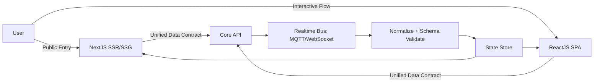

# Core Engine: Hybrid Architecture (ReactJS + NextJS)

## Design Philosophy
Core Engine implements a **Hybrid UI Architecture** based on the principle of "one logic, two presentation layers." **ReactJS** handles **high-interaction workflows** and **real-time UX**, while **NextJS** serves **SSR/SSG entry points** to optimize **SEO** and **first paint**. Both UI layers share the same **Unified Data Contract**, ensuring consistent rendering behavior without duplicating business rules.

Key principles:
- **Unified Data Contract** keeps a stable JSON schema across SPA and SSR.
- **Dual Routing Mechanism** separates public entry points and micro-flows.
- **Shared Components** reduce divergence between admin web and public web.

Unified Data Contract (sample):
```json
{
  "id": "mission_4821",
  "type": "p2p_task",
  "status": "processing",
  "payload": { "target": "tiktok", "action": "follow" },
  "meta": { "ttl": 300, "version": "v2" }
}
```

## Data Flow Pipeline
Data flows through the **API Gateway** and **Realtime Bus** (MQTT/WebSocket), and is **normalized** before entering the state store to maintain low **Real-time Latency** and synchronized UI updates.


```mermaid
flowchart LR
  U[User] -->|Public Entry| N[NextJS SSR/SSG]
  U -->|Interactive Flow| R[ReactJS SPA]

  N -->|Unified Data Contract| API[Core API]
  R -->|Unified Data Contract| API

  API --> BUS[Realtime Bus: MQTT/WebSocket]
  BUS --> NORM[Normalize + Schema Validate]
  NORM --> STORE[State Store]

  STORE --> R
  STORE --> N
```

**Dual Routing Mechanism**:
```text
if (route.public) -> Next Router (SSR/SSG)
else -> React Router (SPA micro-flows)
```

## Performance Optimization
The system applies a **2-Layer Caching Strategy** to optimize throughput:
- **Layer 1 (Client Store Cache)**: React store-level caching enables immediate responses.
- **Layer 2 (SSR/Runtime Cache)**: Next build/runtime caching reduces server load.

```text
cache.l1.get(key) -> render immediate
cache.l2.get(key) -> warm SSR payload
```

Optimization highlights:
- **Virtual DOM diffing** reduces repaint during real-time updates.
- **Route-level prefetch** improves **first contentful paint**.
- **Normalized event payloads** reduce serialization overhead.
- **Shared schema** eliminates duplicate logic and lowers bug surface.
